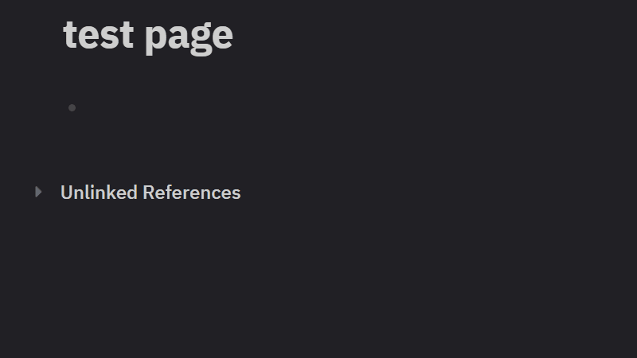

# Autocorrect for Logseq (UK English)
Fast, conservative autocorrect while typing in Logseq.  
Fixes common typos on **word boundaries** (space / punctuation / Enter) without heavy linting, grammar checking, or cloud services.
This plugin is designed to feel invisible: you type, mistakes quietly disappear, and your notes remain plain Markdown.
**UK English Focus**: This extension prefers UK English spellings (colour, favour, organise, etc.) and will never auto-convert UK → US spellings.


---
## Why this exists
Logseq’s built-in spellcheck highlights mistakes, but **fixing them interrupts flow**.  
Other tools add grammar or style “linting” that feels slow, noisy, or distracting.
**Autocorrect for Logseq** exists to solve a narrower problem:
- You write quickly
- You make predictable typos
- You want them fixed instantly
- You *don’t* want grammar rules, popups, or background scanning
This plugin does one thing well: **safe, instant typo correction while typing**.
---
## What it does
- Autocorrects common typos only when you finish a word (on word boundaries)
- Operates only on the **currently edited block**
- Keeps your notes as plain `.md` files
- Works fully offline by default
- Supports optional, cached remote dictionary updates
- **UK English preferred**: Never corrects UK spellings (colour, favour, etc.)
- **Conservative**: Avoids ambiguous corrections (won't change "from" to "form")
### Examples
Common typos that get corrected:
- `teh` → `the`
- `helath` → `health`
- `woudl` → `would`
- `commnity` → `community`
- `socila` → `social`

UK English words that are **never** corrected:
- `colour`, `favour`, `behaviour`, `honour`, `labour`
- `organise`, `realise`, `recognise`, `analyse`
- `centre`, `metre`, `theatre`
- And many more...
---
## What it does *not* do (by design)

- ❌ No grammar checking
- ❌ No style suggestions
- ❌ No full-document scanning
- ❌ No cloud dependency by default

If you want grammar tools, use them separately. This plugin focuses on typing speed and flow.

---

## Installation

### For Users (Once Published)

1. Open Logseq
2. Go to **Settings → Plugins**
3. Search for "Autocorrect for Logseq"
4. Click **Install**

### For Developers

1. Clone this repository
2. Install dependencies:
   ```bash
   npm install
   ```
3. Build the plugin:
   ```bash
   npm run build
   ```
4. Enable **Developer Mode** in Logseq
5. Open **Plugins → Load unpacked plugin**
6. Select the plugin's `dist/` directory

### Testing

See [TESTING.md](TESTING.md) for detailed step-by-step testing instructions.

---

## Build Commands

```bash
# Install dependencies
npm install

# Build the plugin
npm run build

# Watch mode (rebuilds on changes)
npm run watch

# Rebuild the dictionary from codespell
npm run build-dict

# Clean build output
npm run clean
```


## Usage

Once installed, the plugin works automatically. It triggers corrections when you:
- Type a space after a word
- Type punctuation (`.`, `,`, `;`, `:`, `!`, `?`)
- Press Enter

### Settings

Access settings via **Settings → Plugins → Autocorrect for Logseq**:

- **Enable autocorrect**: Turn the plugin on/off
- **Mode**: 
  - `safe` (default): Conservative corrections only
  - `expanded`: More aggressive corrections (future feature)
- **Use remote dictionary updates**: Enable automatic dictionary updates
- **Remote dictionary URL**: URL to fetch dictionary updates from (JSON format)
- **Remote update interval**: How often to check for updates (hours)
- **Personal rules**: Add your own custom corrections manually via Settings. Supports JSON format (matches `base_safe.json`) or line-based format. Multiple JSON rules must be inside curly braces `{}` and separated by commas: `{"typo1": "correction1", "typo2": "correction2"}`. See "Personal Rules Format" section below for details.

### Personal Rules Format

Personal rules can be added manually in the plugin settings. There are two supported formats:

**JSON format (recommended, matches dictionary format):**

Multiple rules must be inside curly braces `{}` and separated by commas:
```json
{
  "teh": "the",
  "woudl": "would",
  "helath": "health"
}
```

**Line-based format (alternative):**
```
teh the
woudl would
helath health
```

Comments (lines starting with `#`) are ignored in line-based format.

**How to add personal rules:**
1. Go to **Settings → Plugins → Autocorrect for Logseq**
2. Scroll to **Personal rules**
3. Enter your rules in either JSON or line-based format
4. Save settings
5. Rules are applied immediately (no reload needed)

**Note**: Personal rules must be added manually via Settings. There is no command palette option for adding rules.

---

## Project Structure

```
autocorrect-for-logseq/
├─ README.md                 # This file
├─ LICENSE                   # MIT License (code)
├─ DICTIONARY_LICENSE.md     # CC BY-SA 3.0 (dictionary attribution)
├─ package.json              # Node / build metadata
├─ logseq.json               # Logseq plugin metadata
├─ tsconfig.json             # TypeScript config
│
├─ dist/                     # Build output (used by Logseq)
│  └─ index.js               # Compiled plugin entry
│
├─ src/                      # Source code
│  ├─ index.ts               # Plugin entry point
│  ├─ autocorrect.ts         # Core autocorrect logic
│  ├─ remote.ts              # Remote dictionary loading
│  └─ dictionary/
│     └─ base_safe.json      # Bundled typo dictionary (63k+ rules)
│
└─ scripts/
   └─ build-dict.ts          # Dictionary builder (from codespell)
```

---

## How It Works

1. **Word Boundary Detection**: The plugin watches for word boundaries (spaces, punctuation)
2. **Word Extraction**: When a boundary is detected, it extracts the word before the cursor
3. **Dictionary Lookup**: Checks if the word matches a known typo
4. **Safety Checks**: Applies conservative filtering:
   - Never corrects UK English words
   - Never corrects ambiguous words (from/form, to/too/two)
   - Minimum word length (5 chars) except for safe short typos
5. **Case Preservation**: Maintains original capitalization
6. **Correction**: Updates the block with the corrected word

---

## License

### Code

This project's code is licensed under the **MIT License**. See [LICENSE](LICENSE) for details.

### Dictionary

The autocorrect dictionary (`src/dictionary/base_safe.json`) is derived from the [codespell](https://github.com/codespell-project/codespell) project and is licensed under the **Creative Commons Attribution-Share-Alike License 3.0 (CC BY-SA 3.0)**.

See [DICTIONARY_LICENSE.md](DICTIONARY_LICENSE.md) for full attribution and license details.

---

## Contributing

Contributions are welcome! Please:

1. Fork the repository
2. Create a feature branch
3. Make your changes
4. Test thoroughly
5. Submit a pull request

---

## Acknowledgments

- Dictionary data from [codespell](https://github.com/codespell-project/codespell) project
- Built for [Logseq](https://logseq.com/)
